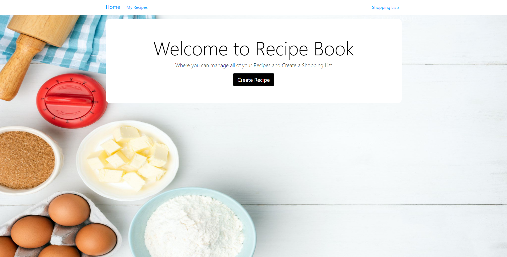

# Recipe App
The Recipe App uses the following technologies and javascript libraries:
* MongoDB
* Express.js
* Node.js
* Express-handlebars
* Mongoose
* Body-parser

## What is this?
The recipe app will keep track of various recipes that you like to cook and eat. Users will be able to add their own recipes, including ingredients and directions. They will also be able to categorize recipes and rate them.

The app will also function as a shopping list. Users will have the ability to add ingredients from their recipes to a shopping list.

## What are the features?
1. As a user I would like to be able to add new recipes
2. As a user I need to be able to add ingredients to a recipe
3. As a user I need to be able to edit ingredients to a recipe
4. As a user I need to be able to remove ingredients to a recipe
5. As a user I need to add directions to a recipe
6. As a user I need to edit direction for a recipe
7. As a user I need to be able to remove directions to a recipe
8. As a user I would like to create new shopping lists
9. As a user I would like to be able to add ingredients to a shopping list
10. As a user I would like to be able to cross items off of a shopping list
11. As a user I would like to be able to remove items off a shopping list
12. As a user I would like to be able to change quantities on a shopping list
13. As a user I would like to categorize recipes and change status of shopping lists
14. As a user I would like to search recipes and lists by key words and titles
15. As a user I need to be able to edit a recipes category
16. As a user I would like to rate recipes
17. As a user I need to be able to change a rating of a recipe

## Mockup / Sketch

## What did I learn and Why is it Important
This project is going to be a great project due to the number of user interactions and data points that will be stored. It will require an interesting data model and multiple API endpoints. The app should be useful as well, it will allow users to keep track of a personal recipe collection and use it for planning and shopping.
